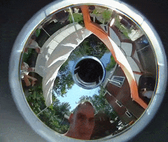
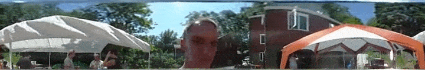
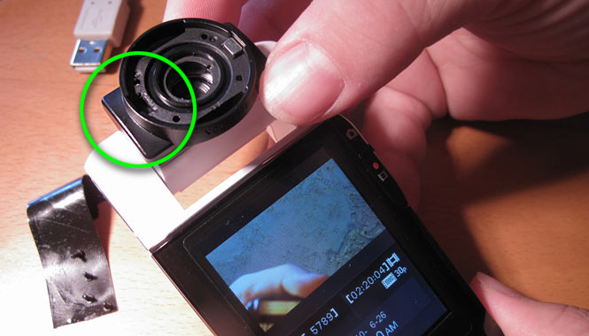

# BloggieUnwarpProcessing

This is a simple Processing tool for exporting unwarped panoramic video frames from the Sony Bloggie camera (MHS-PM5K). This is a 2022 update to the older project (from 2010) described [in this blog post](http://www.flong.com/blog/2010/open-source-panoramic-video-bloggie-openframeworks-processing/).

* By Golan Levin, 2022, revised from 2010
* For Processing 4.0b7+
* Only tested on OSX 12.3.1

### INSTRUCTIONS:

1. Install Processing from [here](https://processing.org/).
2. Launch Processing; install the "Video Library for Processing 4" by going *Sketch -> Import Library -> Add Library...*
3. Download this project by clicking on the green "Code" button in the upper right of Github, and selecting "Download ZIP". After unzipping the bundle, make sure that this sketch folder is called "BloggieUnwarpProcessing". Processing will complain if the main BloggieUnwarpProcessing.pde file is in a folder with a different name.
4. Make sure your Bloggie video opens in Quicktime. Put your Bloggie video in the "data" folder of this sketch.
5. Edit the "settings.txt" file so that INPUT_WIDTH, INPUT_HEIGHT, and INPUT_FRAME_RATE match the properties of your Bloggie video.
6. Click Play (Command-R) to run this sketch; your video should play.
7. Adjust the horizontal position of the video with the mouseX. 
8. Use the arrow keys to adjust the center point of the annulus. This will get rid of any "sine wave" warping across the panorama.
9. Press the 'e' key to begin exporting JPG frames from the video. These will appear in a new "output" folder (in this sketch folder). Keep an eye on the export progress in the Processing console. 
10. Use your favorite video software to reassemble the video frames into a video. Sorry there's no video export in this project.

---

### More Information

This open-source, cross-platform Processing tool unwarps the panoramic videos produced by the Sony Bloggie MHS-PM5K solid-state camera. This camera allows for the creation of 360-degree panoramic digital video at a consumer price-point. Here’s an example:



You may wish to transform this “donut vision” (annular) video into something more useful, such as a long panoramic strip — a process variously called unwarping, dewarping, inverse warping, remapping, reprojection, rectilinearization, or distortion correction. From the above image, this project produces unwarped frames like this: 



#### Sourcing the Bloggie and its Panoramic Lens Attachment.
The Sony Bloggie MHS-PM5K comes with an included 360-degree panoramic lens attachment. You may hear this accessory erroneously referred to as a “fisheye lens“, but it’s actually a hyperbolic or parabolic mirror (with an optical path folded by a flat mirror, as it turns out) known as a catadioptric reflector. This panoramic lens attachment, which easily clips on and off the body of the camera, is the black piece shown above. The attachment is Sony Part Number X25467051, a “360 VIDEO ACCESSORY”, labeled VCL-BPP1 on its body. The attachment really does come with the camera! But as an isolated component, this accessory is also available here through Sony’s services site (Tel. 1-800-488-7669) for 82.95 USD.


#### Limits on the Resolution of Resulting Panoramas

The Sony Bloggie is capable of recording non-panoramic HD video at resolutions up to 1920×1080 (30fps). Unfortunately (and this isn’t well-advertised), the Bloggie only records *panoramic* digital video at 1280×720. In video mode, the camera auto-detects the panoramic lens attachment (magnetically, it turns out) and switches to the lower resolution. Moreover, by the time the unwarping process has removed the wasted black pixels (inside and around the warped video annulus), it becomes clear that the maximum effective vertical resolution of the Bloggie’s panoramic video is only about 256 pixels, which may or may not suit your purposes. Used in still-picture mode, the Bloggie is able to create panoramic source images with its full (5 megapixel, 2592×1944) resolution; the effective vertical resolution of its panoramic stills is then 512 pixels. Since the Bloggie lens accessory has a vertical FOV of approximately 60 degrees (some measurements have suggested it's actually between 52.5°-54.5°), panoramas produced with these optics should have aspect ratios close to (360/60) ≈ 6:1. 

It is possible to modify the X25467051 Bloggie lens accessory to enable 1920×1080 panoramic video recording (instead of 1280×720). To do this, see the underside of the accessory to locate 4 very small cross-head screws. Removing these four screws allows the optics to be separated from the mounting base. Once separated, you will find two small rare-earth magnets inset into the the inner (upper) surface of the base. These magnets (each about 3x4mm) can be extracted with a small flat screwdriver. It turns out that only the *left* magnet needs to be removed for the hack to work; I recommend only removing one magnet in order to preserve maximum flexibility for your optics. The photo below shows the inner surface of the base. At the bottom right of the photo is the optics half of the assembly. 



Using the 1080p-resolution annular videos with the BloggieUnwarper software is straightforward. The ```MAX_R_PERCENT``` and ```MIN_R_PERCENT``` settings must be changed to approximately 1.2648 and 0.3018, respectively. Note that there is an important caveat about this modification, however: the panoramic donut will be truncated on the top and bottom. For more information on this mod, [see this blog post](http://www.flong.com/blog/2010/modding-the-bloggie-panoramic-lens-accessory/).

#### An Opportunity for Real-Time Panoramic Video

The BloggieUnwarper software can compute unwarped panoramas in real-time or faster. And happily, the Bloggie camera can also produce real-time panoramic video, through its analog NTSC/PAL composite video output, using the proprietary Sony HandyCam Audio/Video Cable ([VMC-15FS A/V](https://www.amazon.com/WYMECT-TV-Out-VMC-15FS-Handycam-Camcorder/dp/B07L7X586R)) which comes with the camera. This interlaced analog video signal produced by the Bloggie is then suitable for 720×480 capture via standard analog capture cards such as the [Yotocap YT-158](https://www.amazon.com/YOTOCAP-Recording-Capture-Convert-Digital/dp/B07R71Q6MT/). An opportunity thus exists for (e.g.) interactive computer-vision based applications that use 360-degree sensing. To be perfectly clear, the Bloggie does not support use as a real-time USB webcam; you’ll need to run its analog video output through a capture card (or fit the Bloggie lens attachment onto some other camera) if you intend to build apps that incorporate real-time panoramic video.

#### Handling Inexact Centering of the Panoramic Optics.

Sad to say, the Bloggie’s removable panoramic attachment is a wee jiggly. As a result, it’s unwise to assume that the optical center of the video donut is located precisely at the location [width/2, height/2]; indeed, the optical center has a movement range of approximately ±2% of the image dimensions. This has significant implications for an unwarping tool; even small differences of a quarter pixel can cause an undesirable sinusoidal “wobble” that runs the length of the panorama. The code provided here allows for the user to adjust the center point of the video annulus, with sub-pixel accuracy.

#### Handling Corrections for Radial/Vertical Nonlinearity

If the Bloggie had a ‘perfect’ catadioptric mirror, there would be no vertical distortion in the unwarped panoramas. Unfortunately, our careful measurements of rectilinear grids photographed with the Bloggie’s panoramic lens attachment proved otherwise; we discovered a minor nonlinear distortion in the radial/vertical dimension of the Bloggie lens. We also discovered that the Bloggie panoramic lens has an asymmetrical vertical field of view, with approximately 80% of the image falling above the horizon, and 20% below. Taking both perspectival distortion and the Bloggie’s off-center vertical optics into account, we computed this distortion, modeled it with a 2nd-order polynomial, and have corrected for this in our unwarping procedure. You’ll need to recalculate these fitting parameters if you wish to use this software with a different catadioptric mirror.

#### Providing Azimuthal/Horizontal Shifting

When unwarping an annular video to a horizontal panoramic strip, the placement of the “zero angle” becomes an important artistic choice. Modifying this angle has the effect of determining the horizontal placement (i.e. centering) of objects in the scene. This project allows for user-determined shifting of this kind.

#### Acknowledgments

Ivan Poupyrev first alerted me to the existence of the Sony Bloggie. Solomon Bisker helped port my original Processing sketch to openFrameworks, and also set up the four-way shootout between IPP, Framewave, OpenCV, and my hand-coded algorithms. Amisha Gadani tracked down purchasing details for the X25467051 lens accessory. Kyle McDonald patiently walked me through learning Git, and collaborated in many stimulating discussions and experimentation related to low-cost panoramic video. This (side-)project was supported by the STUDIO for Creative Inquiry at Carnegie Mellon University, with the help of grants from the Fine Foundation and the National Endowment for the Arts. This project has been featured at Hack-a-Day.

#### Keywords

Golan Levin, Flong, Processing, openFrameworks, #Processing, #openFrameworks, Sony Bloggie camera, 360° video, 360-degree pano, panoramic video, catadioptric reflector, hyperbolic reflector, parabolic mirror, unwarp, dewarp, inverse warp, remap, reprojection, rectilinearization, distortion correction, free open-source code, Java, C++, software, free video tools, optics, lens, attachment, one-shot panoramic imaging, download, Bloggie software for Mac OSX, free Bloggie for MaxOS X, Mac OS X.

#### References

* “A Theory of Single-Viewpoint Catadioptric Image Formation“, S. Baker and S.K. Nayar. International Journal on Computer Vision, Vol.35, No.2, pp.175-196, Nov, 1999.
* “Image Warping / Distortion“, P. Bourke. http://local.wasp.uwa.edu.au/~pbourke/miscellaneous/imagewarp/, Dec. 2002.

#### Licence

This software is licensed under the CC-GNU LGPL version 2.1 or later.
CC-GNU LGPL